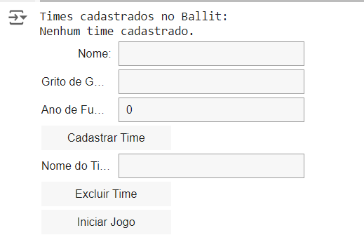
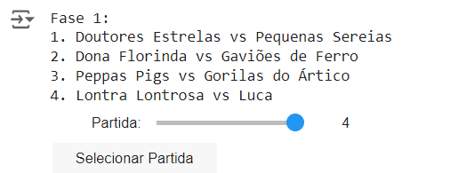
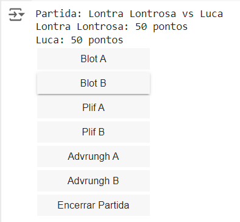
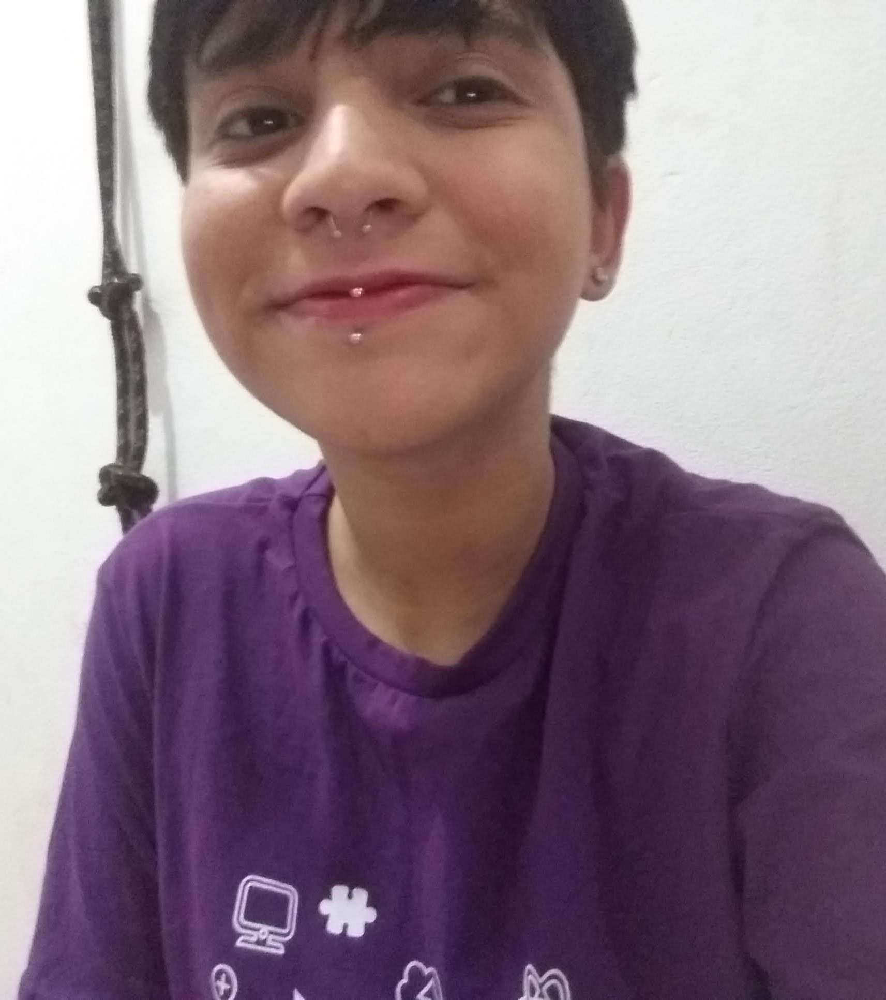

# Projeto Ballit Game

### Um sistema de gerenciamento do campeonato internacional de Ballit, um jogo esquisito. Ele tem como objetivo criar uma interface interativa com o usuário, no qual ele possa cadastrar times, administrar suas partidas e verificar as estatísticas de desempenho de cada time.

## Status do projeto
🚧 Projeto Finalizado 🚧

## Índice
- <a href="funcionalidades">Funcionalidades do Projeto</a>
- <a href="layouts">Layouts</a>
- <a href="demonstracao">Demonstração</a>
- <a href="comoRodar">Como rodar esse projeto?</a>
- <a href="tecnologias">Tecnologias Utilizadas</a>
- <a href="passos">Próximos Passos</a>

## Funcionalidades do Projeto

- [x] Cadastro de times
- [x] Exclusão de times
- [x] Início do jogo
- [x] Selecionador de Partidas
- [x] Administração de Partidas
- [ ] Desempate de Partidas
- [x] Tabela de estatíticas

## Layouts
### Imagens do sistema em funcionamento:

Página do Cadastro:

Página de Selecionador de partida:

Página de controle:

Tabela de Estatísticas:

## Demonstração
[Link demonstração](https://colab.research.google.com/drive/1DguedB9gtbOkhpKDslu8pnQ49jU1iYb0#scrollTo=u9D1nsyH68DK&line=222&uniqifier=1)

## Como rodar este projeto?
    O projeto foi elaborado no ambiente Google Colab, ou Colaboratory, uma plataforma gratuita que oferece um notebook interativo que permite a criação e execução de códigos diretamente no navegador, sem a necessidade de configurações ou instalações de software.

    Apenas algumas importações de bibliotecas e ferramentas serão necessárias.

## Tecnologias Utilizadas

1. [Google_Colab](https://colab.google/)
2. [Python](https://www.python.org/)
3. [Random](https://www.random.org/)
4. [IPython](https://ipython.org/)
5. [ipywidgets](https://ipywidgets.readthedocs.io/)

## Pessoas autoras

 Prazer, meu nome é Eduarda Antunes Coelho. Tenho dezenove anos e sou apaixonada pelo universo da programação, especialmente pelo Front-end, desde meus dezesseis. Abaixo, segue o link do meu Linkedin para consultar mais informações sobre mim! 

[Linkedin](https://www.linkedin.com/in/eduarda-antunes-coelho-509a76211/?lipi=urn%3Ali%3Apage%3Ad_flagship3_feed%3Bgsp9TNEARiqSvuKRp04hEw%3D%3D)

## Próximos Passos

* Implementar as funcionalidades que faltam;
* Corrigir erros notáveis;
* Criar uma interface gráfica mais bonita.
 